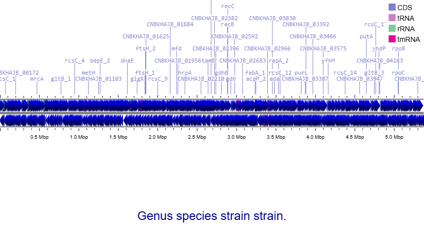
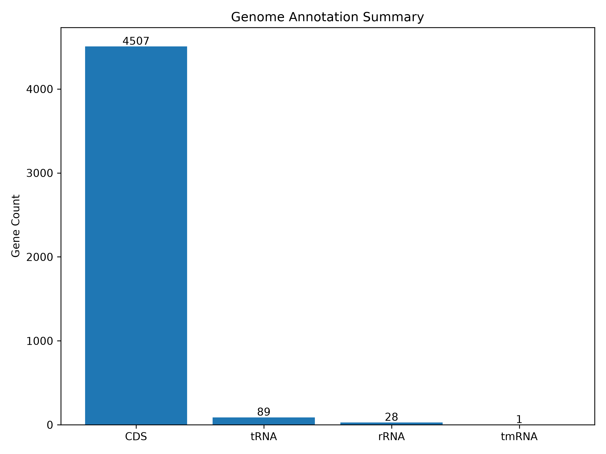
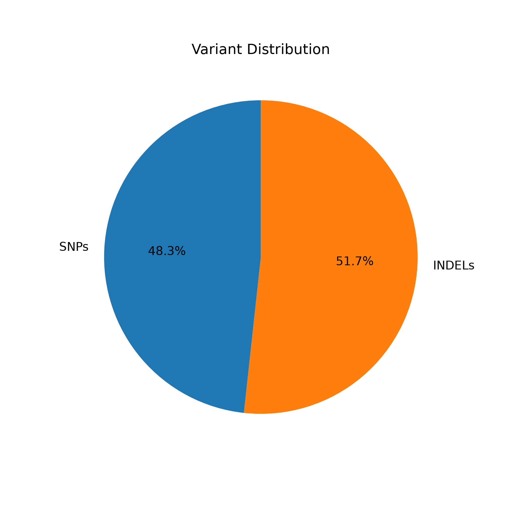
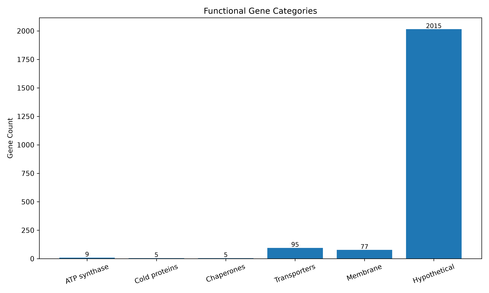

# Bacterial Whole Genome Analysis Pipeline

An end-to-end bacterial whole genome sequencing (WGS) bioinformatics pipeline developed using Linux (WSL), Bash, and Python.

## Pipeline Overview

This project performs:

- Quality Control
- Read Trimming
- Genome Alignment
- Variant Calling
- Genome Annotation
- Functional Annotation
- AMR Analysis
- Virulence Analysis
- Functional Pathway Analysis
- Genome Visualization
## Workflow

  

## Circular Genome Map

Generated using **Proksee** from the Prokka-annotated GenBank file.

  

## Results

### Genome Annotation Summary

  

### Variant Distribution

  

### Functional Gene Categories

  

## Key Findings

| Feature | Result |
|---------|--------|
| Genome Size | 5.37 Mb |
| CDS | 4507 |
| tRNA | 89 |
| rRNA | 28 |
| tmRNA | 1 |
| Variants | 29 |
| SNPs | 14 |
| INDELs | 15 |
| Cold Shock Proteins | 5 |
| ATP Synthase Genes | 9 |
| Transporters | 95 |
| Membrane Proteins | 77 |
| Hypothetical Proteins | 2015 |

## Software Used

- FastQC
- MultiQC
- Fastp
- Bowtie2
- SAMtools
- BCFtools
- Prokka
- DIAMOND
- ABRicate
- Proksee
